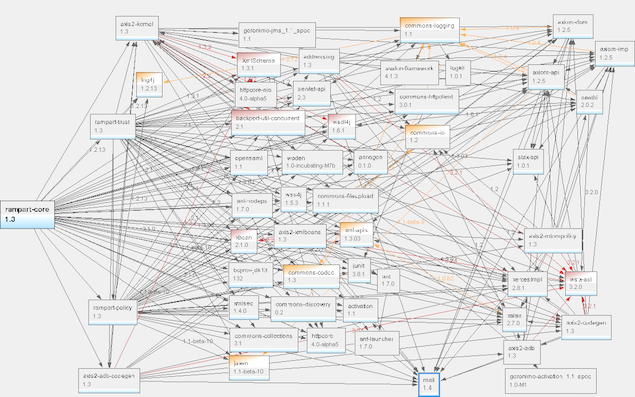

# __DecaStore__

## Technical Road Map

by Serguei Cambour
February 2018
---

---

### Comment choisir parmi les frameworks existants ?
---

---

### Le choix est vraiment trooooop vaste ...
---
### The back-end winner is


Plus de 4,500 personnes ont déjà contribué au code de [Ruby on Rails](http://rubyonrails.org/).
---

- Server-side web application framework écrit en __Ruby__
- Crée par __David Heinemeier Hansson__ (aka _DHH_)
- Première version: le __13 décembre 2005__
- Dernière version: __5.1.5__, sortie le  __14 février 2018__
---

_Ruby is simple in appearance, but is very complex inside, just like our human body_.
- Object-oriented, imperative, functional, reflective
- OS: Cross-platform
- Créé par __Yukihiro Matsumoto__ (aka _Matz_), le 21 décembre 1995 (comme Java :smile: )
- [Dernière version](http://ruby-doc.org/core-2.5.0/): __2.5.0__,  sortie le 25 décembre 2017
---

- une très bonne documentation
- pas de XML(!)
- convention over configuration
- utilise Ruby
- énorme répo de gems (petites librairies) sur [RubyGems](https://rubygems.org/) -a package management framework pour Ruby.
---

[Rails Guides](http://guides.rubyonrails.org/) Guides RoR pour dévenir vite productif avec Rails
---

[Rails API documentation](http://api.rubyonrails.org/) pour plus d'infos sur modules, classes, méthodes.
---

La colonne vertébrale d'une application Rails est le pattern **Model-View-Controller** qui organize l'application en 3 couches principales:
---

- Le **Model** est géré principalement par Active Record
- Le **Controller** est géré par Action Controller
- La **View** par Action View, présenté ensemble comme Action Pack
---

A part ces 3 _amigos_, Rails est encore livré avec:
- **Action Mailer**, pour envoyer des mails en HTML ou plein text.
- **Action Cable** pour fournir "live updates" des pages via WebSockets
- **Active Support** améliore Ruby standard library avec méthodes et classes supplémentaires.
---

Mais il y a  encore:
- **IRB** (Interactive Ruby shell) pour exécuter Ruby code dans le Terminal
- **Rails Console** pour 'jouer' avec code Rails, requêtes SQL dans le Terminal
- **Database Migrations**: pour mettre à jour, modifier votre schema et tables BDD en Ruby
---
Pas de __XML__, votre configuration vit dans des fichiers  __YAML__:
```
# database.yml
default: &default
  adapter: postgresql
  encoding: unicode
  user: postgres
  password:
  pool: 5

development:
  <<: *default
  database: decastore_development
test:
  <<: *default
  database: decastore_test
production:
  <<: *default
  database: decastore_production
  username: decastore
  password: <%= ENV['DECASTORE_DATABASE_PASSWORD'] %>
```
---
Les paramètres de votre application sont dans le fichier `application.yml`
```
# application.yml provided by Figaro gem
development:
  oauth_site: 'https://preprod.idpdecathlon.oxylane.com/as/authorization.oauth2'
  client_id: 'decastore'
  client_secret: '2e53Wu3PLmUqW1CfzStdsJUHM2LltvwFPU6gogDPe5w19eTi5FET6RJCqiHVDh1L'
  proxy_url: 'http://gateway.zscaler.net'
  proxy_port: '80'

test:
  oauth_site: 'https://preprod.idpdecathlon.oxylane.com/as/authorization.oauth2'
  client_id: 'decastore'
  client_secret: '2e53Wu3PLmUqW1CfzStdsJUHM2LltvwFPU6gogDPe5w19eTi5FET6RJCqiHVDh1L'
  proxy_url: 'http://gateway.zscaler.net'
  proxy_port: '80'
  ```
---

### Comment sont gérées les dépendances ?
---

---

__Bundler__ s'en occupe! Toutes les dépendances sont définiés dans le fichier `Gemfile`:
```
# Gemfile
ruby '2.4.0'

gem 'rails', '~> 5.1.4'
gem 'pg',                         '~> 0.21.0'
gem 'figaro',                     '~> 1.1.1'
gem 'jwt',                        '~> 2.1'
gem 'geocoder',                   '~> 1.4', '>= 1.4.4'
gem 'active_model_serializers',   '~> 0.10.6'
gem 'rest-client',                '~> 2.0', '>= 2.0.2'
.....
```
---

Chaque gem est declaré dans son groupe d'environnement:
```
# Gemfile
group :development, :test do
  gem 'ffaker',     '~> 2.1.0'
end

group :test do
  gem 'database_cleaner'
end

group :production do
  gem 'rails_12factor'
  ....
end
```
---

Vous pouvez avoir autant de versions Ruby installées que vous voulez sur votre poste.
[Ruby Version Manager](http://rvm.io/) (RVM) le détecte via `Gemfile` automatiquement.
---
### Rails console à votre service:

Avec `rails c --sandbox` toute modification dans la BDD sera annulée à la sortie.
---
Rails est installé avec son propre serveur d'application - __Puma__.

---

### Qui utilise Ruby on Rails ?

- [GitHub](https://github.com/)
- [Airbnb](https://www.airbnb.com/)
- [Hulu](http://www.hulu.com/)
- [Twitch](https://www.twitch.tv/)
- [Basecamp](https://basecamp.com/)
et beaucoup d'autres... Ceux-ci ne sont que des grands.
---
The front-end winner is

A framework for creating ambitious web applications
---

- basé sur le pattern Model–view–viewmodel (MVVM)
- Créé par __Yehuda Katz__
- Première release: le 8 décember 2011
- Dernière version: __3.0__, sortie le __14 février 2018__
---

Il fournit quelques petites libraries JavaScript comme **router.js** pour routing, **rsvp.js** pour gérer les promises, **backburner** pour gérér le cycle d'exécution, et **Handlebars** pour le rendu de pages HTML.
---

Utilisé par beaucoup de sites-web comme Discourse, Groupon, LinkedIn, Vine, Live Nation, Nordstrom, Twitch.tv,
---

Considéré principalement comme framework Web, il est aussi possible de créer des applications Desktop et mobiles.
L'exemple le plus connu d'une app desktop est __Apple Music__, une fonctionnalité de __iTunes__.
---
## Les briques principales de Ember JS

[Ember CLI](https://guides.emberjs.com/v3.0.0/configuring-ember/configuring-ember-cli/): Un kit d'outils pour créer, développer et compiler applications Ember.
---

[Routing](https://guides.emberjs.com/v3.0.0/routing/): La partie centrale Ember.
---

[Templating engine](https://guides.emberjs.com/v3.0.0/templates/handlebars-basics/) - Utilise la syntaxe __Handlebars__ pour construire les templates HTML.
---

[Data layer](https://guides.emberjs.com/v3.0.0/models/) - utilise Ember Data et permet de communiquer avec APIs externes et gérer l'état de l'application.
---

[Ember Inspector](https://guides.emberjs.com/v3.0.0/ember-inspector/) - Extension de navigateur pour observer le comportement l'application.
---

Un gestionnaire de dépendances rapide, fiable et sécurisé
---

#### Le choix technique
- __Rails API__ comme [JSON API](http://jsonapi.org/) back-end
- __JWT__ authentication (Implicit grant flow)
- __Ember Simple Auth__ add-on (lightweight library for implementing authentication/authorization with Ember apps)
- __Bootstrap 4__ (CSS framework)
---

---
### Ember Simple Auth:
* maintient la session et synchronise son état à travers de multiples onglets et fenêtres de l'application.
* authentifie la session contre propres serveurs d'applications, mas aussi services externes comme Facebook, Twitter etc.
* authorize les requests vers serveurs backend.
* facile à personnaliser et extensier
---

On peut développer une app Ember sans avoir besoin de back-end!
---

Juste utilisez
add-on [EMBER-CLI MIRAGE](http://www.ember-cli-mirage.com/)
---
__Mirage__ est un outil pour simuler un serveur API. Vous définissez vos `route handlers` pour répondre aux requests AJAX de votre application.
```
// mirage/config.js
export default function() {
  this.namespace = 'api';

  this.get('/authors', () => {
    return {
      authors: [
        {id: 1, name: 'Zelda'},
        {id: 2, name: 'Link'},
        {id: 3, name: 'Epona'},
      ]
    };
  });
}
```
---

Utiilisez animations et transitions fournies avec
[Liquid Fire](https://ember-animation.github.io/liquid-fire/) dans votre app Ember JS
---

### A quoi ressemble un projet Ruby on Rails ?
---

---

### Et une aplication Ember ?
---

---
Déçu de Ruby on Rails en back-end ?

Pas de problèmes, - replacer-le avec ce que vous voulez à condition que votre back-end envoie JSON `application/vnd.api+json`.
et __Ember JS__ ferra son job comme avant.
---
Ember JS ne vous convient pas non plus ?

Pas trop grave non plus, - choisissez ce que vous aimez et branchez-le avec Ruby on Rails en back-end.
---
### Comment faire avec les tests ?

[RSpec](http://rspec.info/) est choisi pour tester Ruby code et [QUnit](https://guides.emberjs.com/v2.18.0/testing/) est un framework de test fourni par défaut avec Ember JS, mais plein d'autres sont disponibles via gems ou add-ons.
---
RSpec vous permet de créer:
- Model specs
- Request specs
- Controller specs
- Feature specs
- Mailer specs
- Job specs
- View specs
- Routing specs
- Helpers specs
---
Un exemple de RSpec request test:
```
RSpec.describe "home page", :type => :request do
  it "displays the user's username after successful login" do
    user = FactoryGirl.create(:user, :username => "jdoe", :password => "secret")
    visit "/login"
    fill_in "Username", :with => "jdoe"
    fill_in "Password", :with => "secret"
    click_button "Log in"

    expect(page).to have_selector(".header .username", :text => "jdoe")
  end
end
```
---
Par défault, lorsque vous créez un nouveau component, helper, service, ou un autre module dans une aplication Ember, Ember CLI va  automatiquement créer un fichier de test QUnit basé sur le générateur utilisé:
- Components
- Helpers
- Controllers
- Routes
- Models
---
#### Et si jamais vous rencontrez une situation à comportement bizarre dans votre application ?

:thumbsup: Pas de soucis !

Coté Ruby vous pouvez utiliser **Byebug** gem (default) ou creuser encore plus avec [Pry](http://pryrepl.org/).

---
Coté Ember il y a aussi excellent
### [Ember Inspector](https://guides.emberjs.com/v2.18.0/ember-inspector/)

un add-on du navigateur pour vous aider à debugger applications Ember.
Disponible pour Chrome, Firefox ou [d'autres navigateurs](https://guides.emberjs.com/v2.18.0/ember-inspector/installation/#toc_via-bookmarklet) via bookmarklet.

### Appareils Mobiles ?
Si jamaisi vous avez besoin d'utiliser Inspector sur un smartphone, vous pouvez installer un add-on Ember CLI Remote Inspector.
---

Et comment faire pour le déploiement?
---
### Outils de deploiement pour Ruby/Rails
- [Capistrano](http://capistranorb.com/)
- [Phusion Passenger](https://www.phusionpassenger.com/)
- [Tools](https://www.engineyard.com/blog/running-rails-on-aws-know-your-options) pour EC2, Elastic Beanstalk, EC2 Container Service(Amazon) ou Engne Yard
- [Heroku CLI](https://devcenter.heroku.com/articles/heroku-cli) pour Heroku
- En conteneur avec [Docker](https://www.docker.com/)
---
### Outils de déploiement pour Ember JS
- [Surge](https://surge.sh/)
- [Heroku CLI](https://devcenter.heroku.com/articles/heroku-cli) pour Heroku
- [ember-cli-deploy](https://github.com/ember-cli-deploy/ember-cli-deploy), le plus compliqué mais aussi le plus flexible.
---

Questions ?
---

